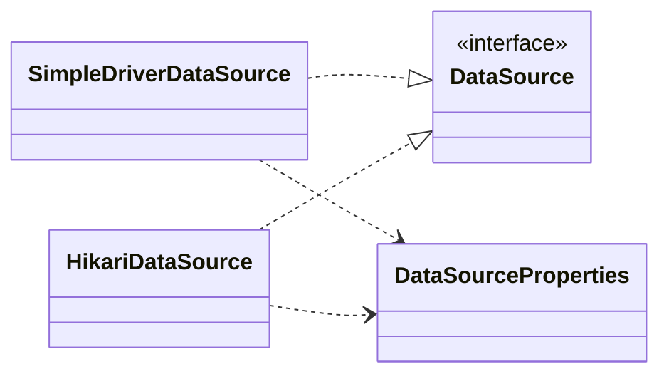
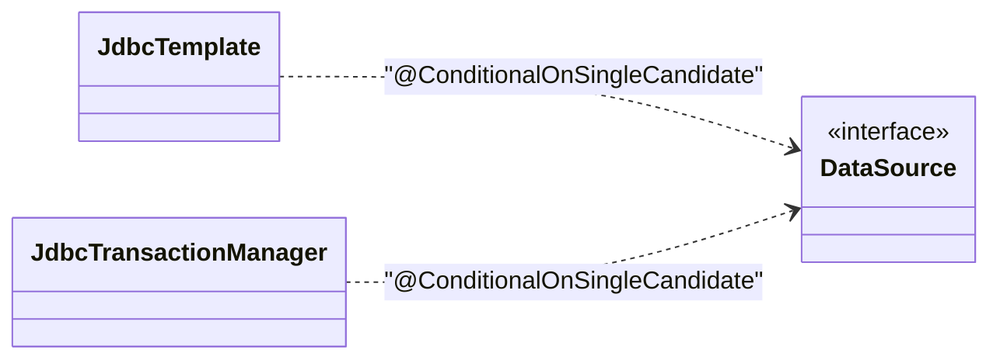

## Spring JDBC 자동 구성 개발

### DataSource

Spring 에서 표준으로 사용하는 DB 연결 구성 정보를 관리하는 인터페이스

해당 인터페이스를 구현체를 빈으로 등록하여 DB Connection 을 맺음.

#### @MyAutoConfigurationDataSourceConfig

```mermaid
classDiagram
    direction LR
    class DataSource
    <<interface>> DataSource
    class SimpleDriverDataSource
    class HikariDataSource
    class DataSourceProperties

    SimpleDriverDataSource ..|> DataSource
    HikariDataSource ..|> DataSource
    SimpleDriverDataSource ..> DataSourceProperties
    HikariDataSource ..> DataSourceProperties

```

```mermaid
classDiagram
    direction LR
    class DataSource
    <<interface>> DataSource
    class JdbcTemplate
    class JdbcTransactionManager
    JdbcTemplate ..> DataSource: "@ConditionalOnSingleCandidate"
    JdbcTransactionManager ..> DataSource: "@ConditionalOnSingleCandidate"
```

