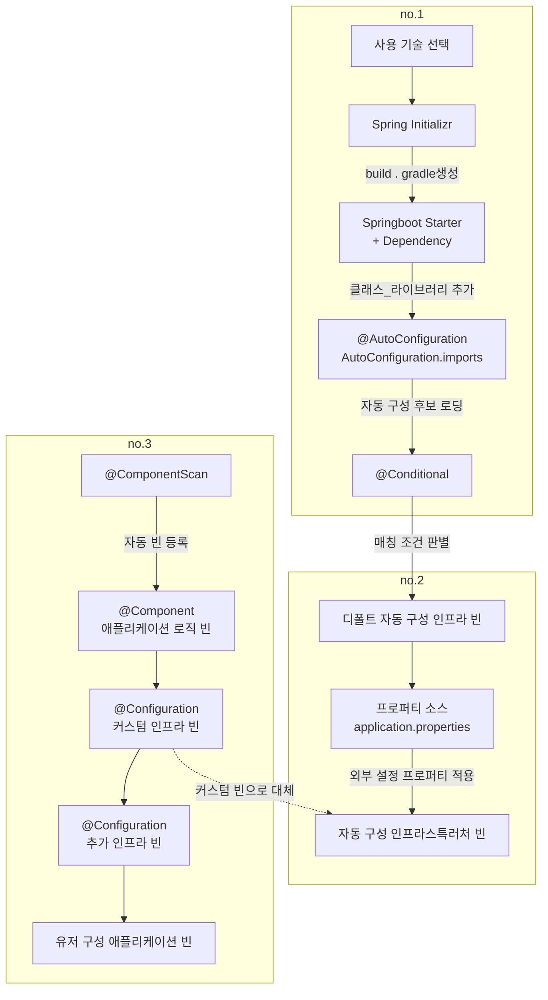
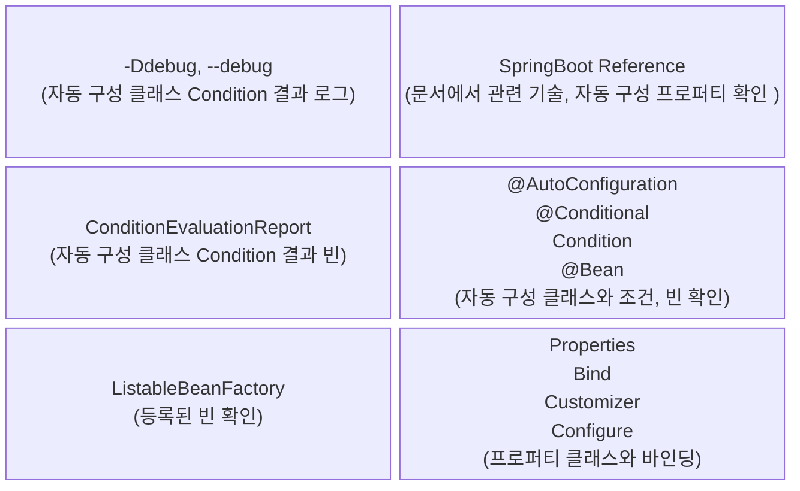

## 스프링부트 자세히 살펴보기

스프링부트가 기본적으로 제공하는 다양한 자동 구성을 어떻게 확인해볼 수 있는가?

어떤 라이브러리를 추가하고, 어떤 프로퍼티를 설정하면 혹은 어떤 커스텀 인프라스트럭처 빈을 추가 시 자동 구성이 어떤식으로 대체가 되서 동작하는지 확인 해봐야됨(중요!)

이제 실무에서는 Spring MVC, JPA, Redis, Cloud Service(AWS, GCP, Azure) 해당 자동 구성 정보를 만들때 무슨일 일어나는지 확인 할 수
있어야됨(중요!!)

사용 기술 선택: AWS 위에서 동작할것인지, Redis를 사용할것인지, Jetty 를 사용할것인지 등등

Spring Initializr: 프로젝트 생성

Springboot Starter + Dependency: 의존 라이브러리 및 클래스 추가

@AutoConfiguration AutoConfiguration.imports: 자동 구성 정보 로딩(144가지의 Springboot 가 기본적으로 제공하는 코어 자동 구성
로딩)

@Conditional: 어떤 조건으로 어떤 구성 정보를 로딩하는지 판별

자동구성 인프라스트럭처 빈 + 유저 구성 애플리케이션 빈 = SpringBoot 가 하나의 애플리케이션 구성 정보를 생성

### Springboot 의 자동 구성으로 어떤게 적용되어있나?

spring-boot-starter 에 기본적으로 포함되어있는 자동 구성 정보 빈

