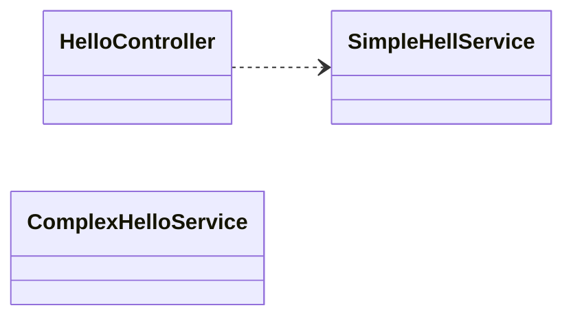
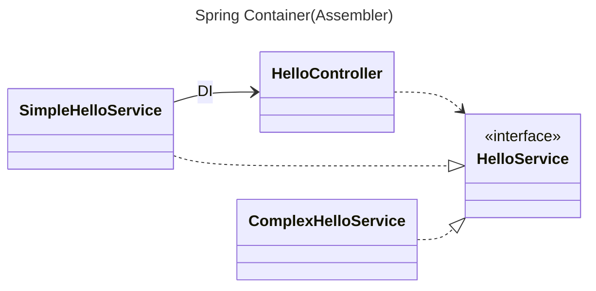

## FrontController 에서 객체를 생성하는것돠 Spring Container에게 위암하여 처리하는것이 뭐가 다를까?

---

Spring Container 가 할수 있는 일들을 하는데 기본 골격을 만들었다는것에 의미가 큼.

### Spring Container 가 실행될 때 기본적으로 객체는 딱 한번만 만듦

새로운 객체를 계속 생성하는것이 아닌 이미 만들어진 객체를 재사용 -> 싱글톤 유지

### Controller, Service

Controller: 웹 요청을 처리, 처리 하기위한 별도의 객체를 호출
> 컨트롤러의 주요 역할의 유저의 요청을 검증하는것! 

Service: Controller 요청을 처리하고 결과를 내는 객체

## DI(Dependency Injection)

만약 외부 라이브러리를 이용해서 ComplexHelloService 를 추가하고 싶다면 HellController 에서 매번 수정해야되는 부담감이 있음

HelloController 는 특정 구현체를 의존하지 않으니 변경이 되어도 영향X 
하지만 런타임에서는 실제 구현체의 코드를 이용해야된다. 
런타임에서 어느 클래스를 사용할지를 결정을 해야된다. 
런타임에서 HelloController 와 SimpleHelloService 의 연관관계를 맺어주는것이 바로 DI(소스 코드에서는 인터페이스에만 의존) 
이 연관관계를 맺어주는 제 3의 존재를 Assembler 라고 불린다. Assembler 가 SimpleHelloService 를 생성해서 HelloController 에게 주입시켜준다. 이 Assembler 가 Spring Container! 

