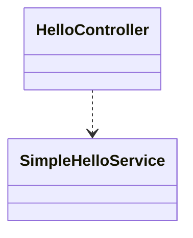
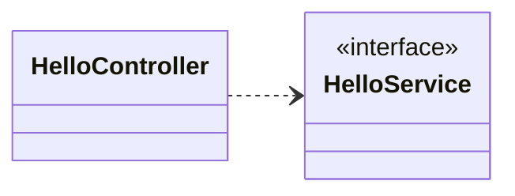
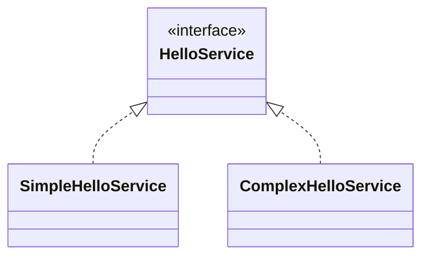
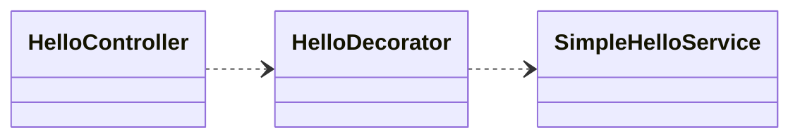

## DI 를 이용한 Decorator, Proxy 패턴

### 직접 의존 하는 경우

의존 방향이 위에서 아래로 향함

### HelloService Interface 에 의존 하는 경우
의존성이 역전이 됨.  
이렇게 되면 HelloService 의 구현체를 자유롭게 교체 가능해짐. -> Controller 입장에서는 바뀐지 모름.  

### 만약 SimpleHelloService 의 비즈니스 로직을 수정하지않고 추가적인 로직을 구현을 하고 싶다면? Decorator 패턴

