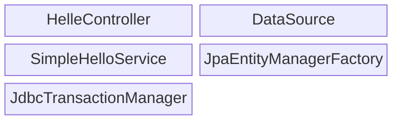
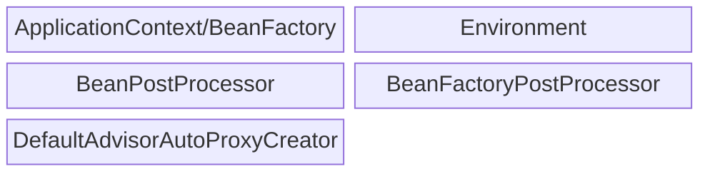
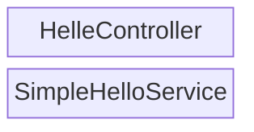
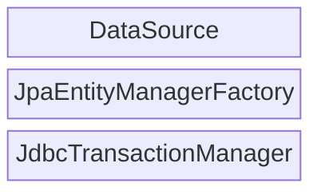
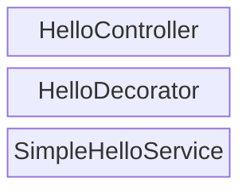
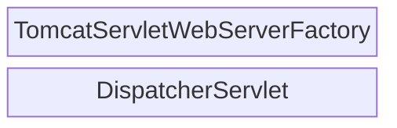
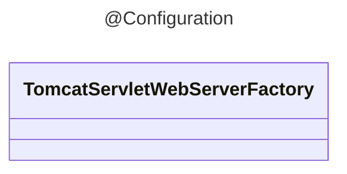
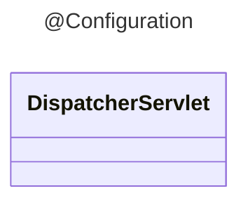

## Bean Object 의 역할과 구분

### Spring 에서 관리하는 Bean 종류와 구분

Bean: Spring Container 에서 관리하는 컴포넌트

#### [애플리케이션 빈]

#### [컨테이너 인프라스트럭처 빈]

애플리케이션 빈: 개발자가 어떤 빈을 사용하겠다고 구성정보를 명시적으로 제공한것

컨테이너 인프라스트럭처 빈: Spring Container 자신, 또는 Container 기능을 구동시키기위한 빈

---

여기서 애플리케이션 빈을 2가지로 나뉠수 있음

#### [애플리케이션 로직 빈]

#### [애플리케이션 인프라스트럭처 빈]

애플리케이션 로직 빈: 애플리케이션의 기능, 비즈니스 로직, 도메인 로직을 담는 빈

애플리케이션 인프라스트럭처 빈: 대부분 기술과 관련, 직접 작성X, 이미 만들어져 있고 구성정보 등록 후 가져다 쓰기만 하면 됨.

### TomcatServletWebServerFactory, DispatcherServlet 은 어디에 속할 수 있는가?

애플리케이션을 구동 시키기 위한 기능이므로 애플리케이션 인프라스트럭처 빈으로 취급할 수 있음.

그러면 SpringBoot 개발자들이 분류하는 방식으로 분리하면?

#### [사용자 구성정보(ComponentScan)]

#### [자동 구성정보(AutoConfiguration)]

자동구성정보를 만들려면 아래처럼 애플리케이션 인프라스트럭처 빈들을 담는 Configuration 클래스를 각각 생성

#### [@Configuration]

#### AuthConfiguration 이란

미리 만들어둔 Configuration 클래스(구성 정보)를 SpringBoot 가 어떤게 필요한지를 판단하고 자동으로 선택해서 사용이 목적

#### ImportSelector & DeferredImportSelector

하드 코딩으로 @Import 를 하는것이 아닌 동적으로 구성 정보 클래스를 로딩하게 만들어주는 Interface
DeferredImportSelector 인터페이스의 실행 시점은 @Configuration 클래스를 모두 등록 된 후 실행
동적으로 DB 정보를 불러온다던가 외부 환경 정보(외부 API) 를 불러오든 동적으로 호출 가능

