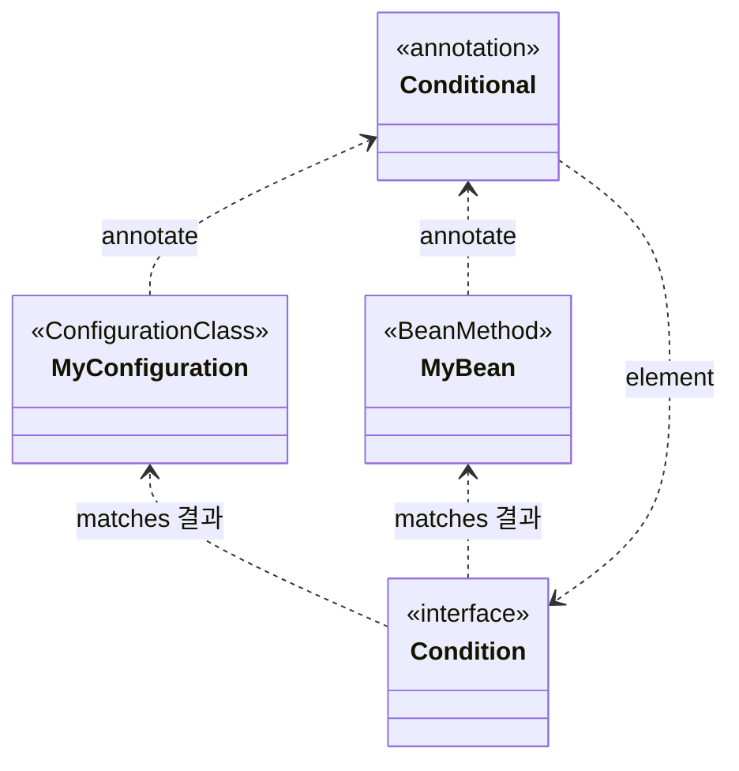

## 스프링 부트의 자동 구성 그 중 핵심이라고 불리우는 조건부 자동 구성

### 조건부 자동 구성이란?

먼저 스프링 부트에서 자동 구성으로 imports 하는 구성 정보를 확인해보자

spring-boot-autoconfigure-2.7.6.jar!
/META-INF/spring/org.springframework.boot.autoconfigure.AutoConfiguration.imports

-> 해당 파일안에는 총 144개의 구성정보가 포함됨.

우리가 Hello, World 라는 문자열을 출력할때도 적어도 144개 이상 빈들이 로딩이됨.

내가 만약 144개의 구성정보를 포함하는 빈중에 사용안하는게 존재한다면? 조건부로 자동 로딩

### Condition 설계

Bean Factory 메소드에도 Conditional 을 적용 가능

그리고 Condition 을 구현하는 메소드에서 true 이면 빈 등록, false 도 빈 등록X

적용 Scope: Class -> Method

e.g) Class 레벨에서 false, Method 레벨에서 true 이면 애초에 Method 레벨은 검사X
Class 레벨에서 true 가 되어야 검사

