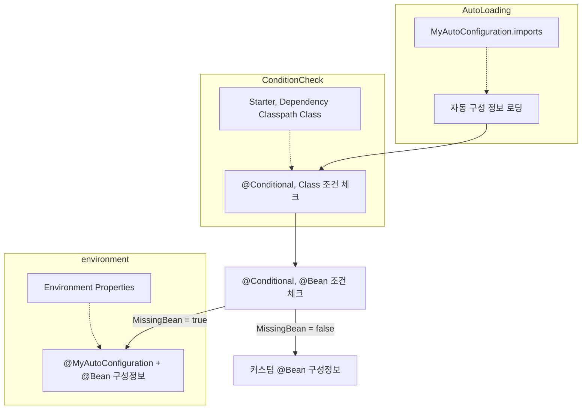
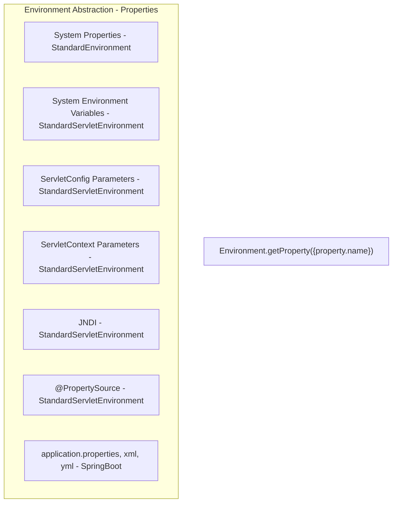
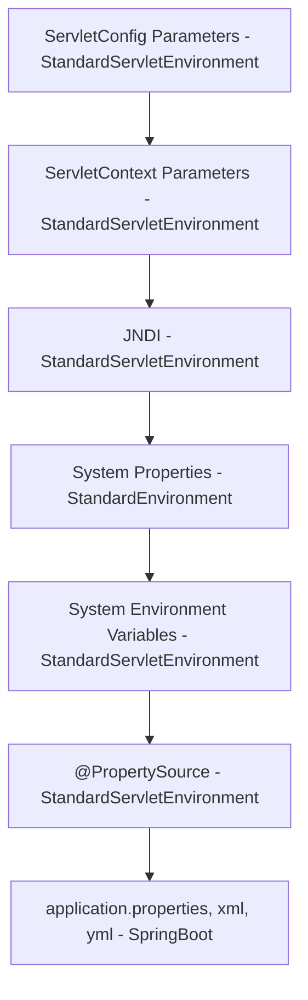

## 외부 설정을 이용한 자동 구성

보통 자동 구성 정보에는 default 값이 다 정해짐

e.g) tomcat - port: 8080

만약 default 값을 필요한 경우를 바꾸고 싶다면?

Configuration 클래스에 다양한 프로퍼티를 변경할 수 있게 Spring 에서는 Environment 추상화를 통해서 가능

우선 순위에 따라 환경 변수 값이 적용됨, 아래는 적용 순서를 표현

